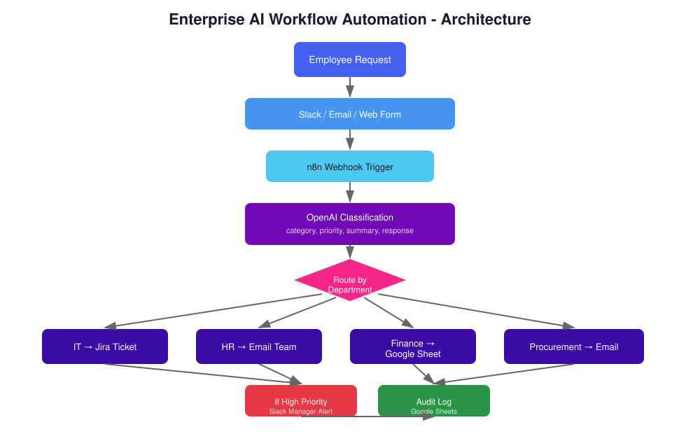

# Enterprise AI Workflow Automation Platform

An AI-powered workflow automation system that classifies and routes employee requests (IT, HR, Finance, Procurement) automatically using OpenAI and n8n, with priority-based manager escalation and audit logging.



## Why This Project

Repetitive employee requests are a common operational drag in mid-size and large organizations: someone has to read each message, decide which team owns it, judge how urgent it is, and route it manually. This project is a portfolio piece that demonstrates how that triage step can be automated with an AI classification layer in front of a deterministic routing workflow.

It's built to show four things specifically: workflow orchestration with n8n, AI-assisted decision making with a constrained output schema (not a free-text chatbot), enterprise integration patterns (ticketing, email, spreadsheets, chat), and a documentation standard that treats audit logging and access control as first-class design concerns rather than afterthoughts, drawing on a background in Identity & Access Management.

## The Problem

Large organizations receive a constant stream of repetitive employee requests across HR, Finance, IT, and Procurement. Most of these requests follow predictable patterns but still require manual triage: someone has to read the message, figure out which team owns it, decide how urgent it is, and route it to the right queue. That manual step is slow, inconsistent, and doesn't scale.

## What This Project Does

This workflow takes a request from Slack, email, or a web form and automatically:

1. **Classifies** it into a department (IT, HR, Finance, Procurement) using OpenAI
2. **Extracts** a summary, priority level, and a suggested response
3. **Routes** it to the right destination: a Jira ticket for IT, an email to HR, a row in a Finance tracking sheet, or an email to Procurement
4. **Escalates** high-priority requests to a manager via Slack for approval
5. **Logs** every decision to an audit trail for compliance and review

## Architecture

```
Employee Request (Slack / Email / Web Form)
        │
        ▼
  n8n Webhook Trigger
        │
        ▼
  OpenAI Classification
  (category, priority, summary, suggested response)
        │
        ▼
  Route by Department (Switch)
   ├── IT          → Jira Ticket
   ├── HR          → Email HR Team
   ├── Finance     → Google Sheets Log
   └── Procurement → Email Procurement
        │
        ▼
  If High Priority → Slack Alert to Manager
        │
        ▼
  Audit Log (Google Sheets)
```

See the full diagram in [`architecture/architecture-diagram.svg`](architecture/architecture-diagram.svg).

## Live Demo

[`demo.html`](demo.html) is a self-contained, browser-based simulation of the classification and routing logic above. It runs entirely client-side and does not call a live n8n instance or real Jira/Slack/Gmail accounts; it exists so the decision logic can be demonstrated without exposing live credentials. The actual production logic lives in [`workflows/employee-request-automation.json`](workflows/employee-request-automation.json), which is a real importable n8n workflow.

## Technologies Used

| Category | Tools |
|---|---|
| Workflow Engine | n8n |
| AI / NLP | OpenAI API (GPT-4o-mini) |
| Integrations | Slack, Gmail, Google Sheets, Jira |
| Data Format | JSON, REST Webhooks |
| Deployment | Docker |

## Repository Structure

```
enterprise-ai-workflow/
├── README.md
├── demo.html                                  interactive browser demo
├── architecture/
│   └── architecture-diagram.svg
├── workflows/
│   └── employee-request-automation.json       importable n8n workflow
├── prompts/
│   └── classification-prompt.md               AI prompt design and rationale
├── docs/
│   └── installation.md                        setup guide
├── examples/
│   ├── sample-it-request.json
│   └── sample-finance-request.json
└── LICENSE
```

## Example

**Input** (employee message via Slack):
> "My laptop won't turn on and I have a client call in an hour. Please help urgently."

**AI Output:**
```json
{
  "category": "IT",
  "summary": "Laptop not powering on, urgent due to upcoming client call",
  "priority": "High",
  "suggested_response": "We've created an urgent IT ticket and a technician will reach out within 15 minutes."
}
```

**Resulting automation:**
- A Jira ticket is created in the IT project with High priority
- Because priority is High, a Slack alert is sent to the manager approval channel
- The decision is written to the audit log with a timestamp

More examples in [`examples/`](examples/).

## Design Decisions

- **Strict JSON output from the AI model.** The classification prompt forces a fixed schema so the routing logic downstream is deterministic, not based on fragile keyword matching. Full reasoning in [`prompts/classification-prompt.md`](prompts/classification-prompt.md).
- **Closed category set.** Keeping categories to IT/HR/Finance/Procurement avoids unpredictable routing paths. Requests that span multiple categories are a known gap, see Production Considerations below.
- **Audit logging on every request**, not just high-priority ones, because access and approval decisions in an enterprise setting need to be traceable, not just automated.
- **Stateless execution.** Each n8n run is triggered fresh by a webhook and does not depend on shared state between executions, which keeps individual runs easy to reason about and replay.

## Enterprise Design Principles

This section separates what the current workflow actually does from what a hardened production version would need. Distinguishing these explicitly is intentional: claiming both as already solved would be misleading.

| Principle | Current state | Production target |
|---|---|---|
| Deterministic routing | Implemented. Closed category set and a Switch node, not free-text matching. | No change needed; this already holds. |
| Stateless workflow execution | Implemented. n8n executions don't share state. | No change needed. |
| Idempotency | Not implemented. A duplicate webhook call (e.g. a network retry) would create a duplicate ticket. | Add a dedupe key, a hash of employee, message, and a time window, checked before the routing step. |
| Separation of concerns | Partially implemented. Classification, routing, and notification are distinct nodes. | Extract the classification prompt and routing rules into versioned config rather than inline node parameters. |
| AI output validation | Partially implemented. The prompt enforces JSON, but there's no schema validation step after parsing. | Add explicit schema validation on the AI response before it reaches the routing node, with a fallback to manual review on failure. |
| Extensibility | Implemented at a basic level. Adding a department means adding a Switch branch and one downstream node. | Move department-to-action mapping into a config table so new departments don't require workflow edits. |

## Reliability

| Concern | Current state | Production recommendation |
|---|---|---|
| Retry on AI call failure | Not implemented. A failed OpenAI call currently halts that execution. | Add a retry-with-backoff wrapper around the classification node, with a max retry count before falling back to manual triage. |
| Malformed AI output | Not implemented. The `Parse AI Output` code node assumes valid JSON. | Wrap parsing in a try/catch; on failure, route to a manual review queue instead of failing silently. |
| Timeout handling | Not implemented. | Set explicit timeouts on each integration call (Jira, Gmail, Sheets, Slack) and define fallback behavior per node. |
| Audit logging | Implemented. Every classified request is written to the audit log regardless of outcome. | Extend the log schema to include execution status (success/failure/retried). |
| Error notification | Not implemented. | Route workflow-level failures to a dedicated alerts channel, separate from the manager-approval Slack channel. |

## Monitoring

The current workflow produces an audit log entry per request, which is real and working. It does not currently capture operational telemetry. A production deployment would add:

- A request ID generated at webhook entry, threaded through every downstream node, so a single request can be traced end to end
- Processing duration per execution, available natively from n8n's execution history
- AI call latency, captured separately from total workflow duration to isolate OpenAI API performance issues
- Success/failure counts and retry counts per execution
- An alert when failure rate over a rolling window crosses a threshold

None of this is built yet. It's listed here because reasoning about it is part of the design, not because it's running.

## Security

Given the integrations involved (Jira, Gmail, Google Sheets, Slack, OpenAI), security is treated as a first-class concern rather than an afterthought.

**Implemented in the current design:**
- API credentials are never hardcoded in the workflow JSON; n8n's credential manager handles secret storage and injection at runtime
- No employee data is persisted outside the audit log and the destination systems themselves (no separate database holding request contents)

**Not yet implemented, documented as production requirements:**
- Webhook authentication. The current webhook trigger has no shared-secret or HMAC signature check, meaning anyone with the URL could submit a request. A production deployment needs this before going live.
- Input validation and sanitization on the incoming message before it's sent to the OpenAI API, particularly to avoid forwarding sensitive fields like salary or medical information into a third-party API call.
- Role-based access control on who can view the audit log and the manager-approval Slack channel.
- Least-privilege scoping for each integration's API token (e.g. the Jira token should only have create-issue permission on the relevant project, not org-wide admin access).

## Production Considerations

**Current limitations**
- No handling for requests that span multiple departments (e.g. "I need a new laptop approved by Finance")
- No idempotency guarantee; duplicate webhook calls can create duplicate downstream actions
- No retry or timeout handling on any integration call
- Approval workflow is single-manager, with no multi-level approval chain
- No webhook authentication

**Planned enhancements**
- Migrate classification to a LangGraph agent for multi-step reasoning on ambiguous or multi-category requests
- Add a lightweight dashboard to visualize request volume and turnaround time by department

**Production recommendations (not on the build roadmap, but necessary before real deployment)**
- Rate limiting on the webhook endpoint
- Dead-letter handling for executions that fail after exhausting retries
- Schema validation on AI output before it reaches routing logic

## Expected Benefits

These are the qualitative benefits this kind of system is designed to produce. No usage metrics or cost figures are claimed here, since this is a portfolio project and has not been deployed in a live organization.

- Reduced manual triage time for repetitive request categories
- Faster routing to the correct team, since classification happens immediately on submission
- More consistent categorization than manual triage, since the same prompt and schema apply to every request
- Better auditability, since every request and routing decision is logged with a timestamp
- Easier compliance reporting, since the audit trail is structured rather than scattered across email threads

## Setup

Full instructions in [`docs/installation.md`](docs/installation.md). Short version: run n8n via Docker, import the workflow JSON, attach your own API credentials, and test with the sample payloads in `examples/`.

## Author

Built by Imdad as a portfolio project demonstrating enterprise AI workflow automation, drawing on a background in Identity & Access Management, particularly in the audit logging, access control, and approval-routing design choices above.
